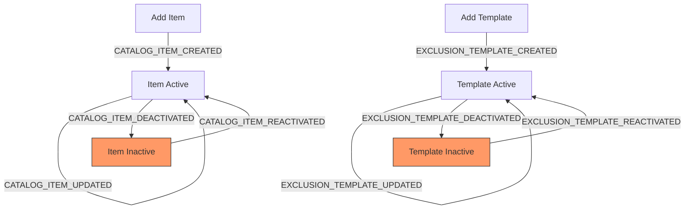
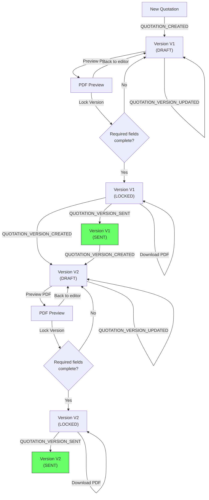
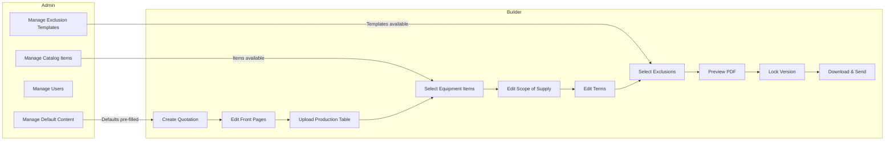

# PRD: Steefo Quotation Preparation Tool

## Source Documents

- `10-observations/001-inbox-analysis-and-call-prep.md` (approved)
- `20-process-maps/001-quotation-creation-current.md` (approved)
- `20-process-maps/002-quotation-creation-proposed.md` (approved)
- `30-analysis/001-gap-analysis.md` (approved)
- `00-inbox/flow-docs/prd-guide.md` (PRD structure reference)
- `00-inbox/flow-docs/event-system-architecture.md` (platform architecture reference)

---

## 1. Process Overview

### Process: Quotation Preparation

Steefo Engineering Corporation assembles technical offer documents (40-200 pages) for Rolling Mill and Billet Plant customers. Each technical offer combines system-generated pages (introduction, technical parameters, basic data, scope of supply, terms, exclusions) with pre-uploaded equipment item PDFs stitched from a centralized catalog.

**Terminology note:** Steefo calls the output document a "Technical Offer" (PDF titles read "Technical Offer QTN-542-R2"). The system UI should use "Technical Offer" as the user-facing term. This PRD uses "quotation" in entity and code-level names for brevity, but all UI labels, headings, and PDF output should say "Technical Offer."

A quotation starts as a draft. The builder fills in project-specific fields, uploads a production table Excel file, selects equipment items from the catalog, adjusts the scope of supply table, edits terms and conditions, and picks exclusion clauses. The builder saves progress across multiple sessions. When ready, the builder previews the assembled PDF, locks the version, downloads the final document, and marks the quotation as sent. If the customer requests revisions, the builder creates a new version from the locked one.

A super admin manages the equipment item catalog (add, edit, deactivate, reactivate items with PDF uploads and default scope rows) and manages user accounts. The super admin also builds quotations.

**Letterhead note:** Steefo's letterhead (logo, company address, phone/fax/email in the footer) is the same across all technical offers. It is a static system template hardcoded by the developer during initial setup. No management screen needed. If the letterhead changes in the future, the developer updates the template.

Flow:

```
  Catalog Management              Quotation Building
      [ADMIN]                        [BUILDER]
         |                              |
  CATALOG_ITEM_CREATED            QUOTATION_CREATED
         |                              |
  CATALOG_ITEM_UPDATED         QUOTATION_VERSION_UPDATED (repeated)
         |                              |
  CATALOG_ITEM_DEACTIVATED     QUOTATION_VERSION_LOCKED
         |                              |
  CATALOG_ITEM_REACTIVATED     QUOTATION_VERSION_SENT
                                        |
                               QUOTATION_VERSION_CREATED (new version from locked)

  Exclusion Template Management     Default Content Management
      [ADMIN]                            [ADMIN]
         |                                  |
  EXCLUSION_TEMPLATE_CREATED      DEFAULT_INTRODUCTION_UPDATED
         |                                  |
  EXCLUSION_TEMPLATE_UPDATED      DEFAULT_TERMS_UPDATED
         |
  EXCLUSION_TEMPLATE_DEACTIVATED
         |
  EXCLUSION_TEMPLATE_REACTIVATED
```

---

## 2. Entities and Aggregates

### Entities

| Entity | Aggregate Type | Relationships |
|---|---|---|
| Catalog Item | `CatalogItem` | Has many Scope Row Templates. Referenced by Quotation Versions (via item selections). |
| Scope Row Template | (embedded in CatalogItem payload) | Belongs to a Catalog Item. Defines default S/C values for one row in the Scope of Supply table. |
| Exclusion Template | `ExclusionTemplate` | Referenced by Quotation Versions (via exclusion selections). Standalone reusable clause. |
| Default Introduction | `DefaultIntroduction` | Single-record entity. Provides the default introduction text pre-filled into new quotation versions. |
| Default Terms | `DefaultTerms` | Single-record entity. Provides the default terms and conditions text pre-filled into new quotation versions. |
| Quotation | `Quotation` | Has many Quotation Versions. Top-level container for project code and QTN code. |
| Quotation Version | `QuotationVersion` | Belongs to a Quotation. Contains all content: front page fields, production table, item selections, scope overrides, terms, exclusions. Has a lifecycle (draft -> locked -> sent). |

### Abbreviations

- **S** = Steefo (Supplier) — Steefo is responsible for this scope item.
- **C** = Customer — the customer is responsible for this scope item.

These abbreviations are used throughout the Scope of Supply table columns.

### Conventions

- **`created_at` fields** are not included in event payloads. Projection services derive `created_at` from the event's `occurred_at` timestamp when inserting new rows. This is a platform-wide convention.
- **`updated_at` fields** follow the same pattern — derived from `occurred_at` on update events.

### Entity Field Definitions

#### Catalog Item

| Field | Type | Description |
|---|---|---|
| id | UUID | Primary key |
| item_code | string | Human-readable identifier (auto-generated, see numbering) |
| name | string | Display name (e.g., "550mm Heavy Duty Roughing Mill") |
| description | string | Short description for catalog listing |
| category | string | Equipment category (e.g., "Mill Equipment", "Auxiliary Equipment", "Electricals") |
| pdf_file_url | string | URL/path to the uploaded PDF file |
| pdf_page_count | integer | Number of pages in the uploaded PDF |
| scope_row_templates | jsonb | Array of default scope rows. Each row: `{sr_no, description, qty, basic_data, basic_design, detailed_design, supply, supervision_of_erection, erection_and_comm, supervision_of_comm}`. Values are `"S"` or `"C"`. |
| display_order | integer | Sort position in the catalog listing |
| status | string | `active` or `inactive` |
| created_at | datetime | When the item was added to the catalog |

#### Exclusion Template

| Field | Type | Description |
|---|---|---|
| id | UUID | Primary key |
| template_code | string | Human-readable identifier (auto-generated) |
| text | string | The exclusion clause text (e.g., "Shed (Hanger), Cranes, Rails & DSL for Crane") |
| display_order | integer | Sort position in the template list |
| status | string | `active` or `inactive` |
| created_at | datetime | When the template was created |

#### Default Introduction

| Field | Type | Description |
|---|---|---|
| id | UUID | Primary key (single record — always the same ID) |
| content | text | The default introduction text pre-filled into new quotation versions |
| updated_at | datetime | When the content was last updated |

Note: Single-record entity. The system creates one record during initial setup. The admin updates it as needed. There is no create/delete lifecycle — only updates.

#### Default Terms

| Field | Type | Description |
|---|---|---|
| id | UUID | Primary key (single record — always the same ID) |
| content | text | The default terms and conditions text pre-filled into new quotation versions |
| updated_at | datetime | When the content was last updated |

Note: Same pattern as Default Introduction. Single record, update only.

**Seeding note for both Default entities:** The developer inserts the initial records via database migration or seed script during deployment. There is no CREATE event — the event trail begins from the first admin update. This is acceptable because the initial content is developer-provided placeholder text that the admin will review and update before first use.

#### Quotation

| Field | Type | Description |
|---|---|---|
| id | UUID | Primary key |
| project_code | string | Project identifier (e.g., "P480") |
| qtn_code | string | Quotation identifier (e.g., "QTN569") |
| latest_version_number | integer | Tracks the highest version number created |
| latest_version_id | UUID | FK to the most recent QuotationVersion |
| created_at | datetime | When the quotation was first created |

#### Quotation Version

| Field | Type | Description |
|---|---|---|
| id | UUID | Primary key |
| version_code | string | Human-readable identifier (auto-generated, e.g., "P480-QTN569-V1") |
| quotation_id | UUID | FK to parent Quotation |
| version_number | integer | Sequential version number (1, 2, 3...) |
| status | string | `draft`, `locked`, or `sent` |
| date | date | Quotation date displayed on the document |
| introduction_text | text | Editable introduction content (page 1). Pre-filled from Default Introduction master. |
| mill_production | string | Technical parameter field (e.g., "25 to 30 Tons / Hr.") |
| basic_raw_material | string | Technical parameter field (e.g., "Billets 100 & 130 mm") |
| finished_products | string | Technical parameter field (e.g., "8 mm to 32mm High Strength TMT Re Bars") |
| power_requirement | string | Basic data field (e.g., "3 MW") |
| production_table_file_url | string | URL/path to the uploaded Excel file |
| production_table_data | jsonb | Parsed production table data for PDF rendering |
| selected_item_ids | jsonb | Array of CatalogItem UUIDs in display order |
| scope_rows | jsonb | Array of scope rows with per-version overrides. Each row: `{sr_no, description, qty, basic_data, basic_design, detailed_design, supply, supervision_of_erection, erection_and_comm, supervision_of_comm, source_item_id}`. Initialized from item scope_row_templates when items are selected. Builder can toggle S/C values and edit qty. Description is read-only (inherited from catalog). |
| terms_content | text | Editable terms and conditions content (pages 72-74). Pre-filled from Default Terms master. |
| selected_exclusion_ids | jsonb | Array of ExclusionTemplate UUIDs selected for this version |
| custom_exclusions | jsonb | Array of custom exclusion strings written by the builder |
| locked_at | datetime | When the version was locked (null if draft) |
| sent_at | datetime | When the version was marked as sent (null if not sent) |
| locked_pdf_url | string | URL/path to the generated PDF (set when locked) |
| created_at | datetime | When this version was created |

### Numbering

| Entity | Prefix | Format | Example |
|---|---|---|---|
| Catalog Item | ITEM | ITEM-{NNNN} | ITEM-0001 |
| Exclusion Template | EXCL | EXCL-{NNNN} | EXCL-0001 |
| Quotation | (none) | {project_code}-{qtn_code} | P480-QTN569 |
| Quotation Version | (none) | {project_code}-{qtn_code}-V{N} | P480-QTN569-V1 |

Note: Quotation and Quotation Version codes are user-provided (project_code and qtn_code), not auto-generated sequences. The system concatenates them. Version number is auto-incremented per quotation.

---

## 3. Process Steps

### Step: Create Catalog Item

Event type: `CATALOG_ITEM_CREATED`

Trigger:
  Super admin navigates to the Catalog Management screen, clicks "Add Item",
  fills in the item name, description, category, uploads a PDF file, defines
  scope row templates with default S/C values, and clicks "Save".

Data points captured:
  - name: string -- item display name
  - description: string -- short description
  - category: string -- equipment category
  - pdf_file: file -- the equipment PDF (uploaded separately, URL passed)
  - pdf_page_count: integer -- page count of uploaded PDF
  - scope_row_templates: array -- list of scope rows with default S/C values
  - display_order: integer -- sort position

Payload:
  id: UUID (generated)
  item_code: string (generated)
  name: string
  description: string
  category: string
  pdf_file_url: string
  pdf_page_count: integer
  scope_row_templates: jsonb
  display_order: integer
  status: "active"

Aggregate: CatalogItem / id

Location: None

Preconditions:
  - Actor must have super admin role

Side effects:
  - Catalog item record created in projection table
  - Item becomes available in the catalog for all quotation builders

Projections updated:
  - catalog_items: new row (id, item_code, name, description, category, pdf_file_url, pdf_page_count, scope_row_templates, display_order, status)

Permissions:
  - events:CATALOG_ITEM_CREATED:emit

---

### Step: Update Catalog Item

Event type: `CATALOG_ITEM_UPDATED`

Trigger:
  Super admin opens an existing catalog item, modifies any fields (name,
  description, category, PDF file, scope row templates, display order),
  and clicks "Save".

Data points captured:
  - Any changed fields from: name, description, category, pdf_file_url,
    pdf_page_count, scope_row_templates, display_order

Payload:
  id: UUID (existing item)
  name: string? (if changed)
  description: string? (if changed)
  category: string? (if changed)
  pdf_file_url: string? (if changed)
  pdf_page_count: integer? (if changed)
  scope_row_templates: jsonb? (if changed)
  display_order: integer? (if changed)

Aggregate: CatalogItem / id

Location: None

Preconditions:
  - Catalog item must exist
  - Catalog item status must be `active`
  - Actor must have super admin role

Side effects:
  - Catalog item projection updated with changed fields
  - Existing locked quotation versions are unaffected (they captured item data at lock time)
  - Draft quotation versions referencing this item will see updated name/description in the catalog picker, but their scope_rows are already copied and remain as-is

Projections updated:
  - catalog_items: partial update (changed fields only)

Permissions:
  - events:CATALOG_ITEM_UPDATED:emit

---

### Step: Deactivate Catalog Item

Event type: `CATALOG_ITEM_DEACTIVATED`

Trigger:
  Super admin clicks "Deactivate" on a catalog item.

Data points captured:
  - (none beyond the item ID)

Payload:
  id: UUID

Aggregate: CatalogItem / id

Location: None

Preconditions:
  - Catalog item must exist
  - Catalog item status must be `active`
  - Actor must have super admin role

Side effects:
  - Item no longer appears in the catalog picker for new quotations
  - Existing quotation versions (draft or locked) that reference this item are unaffected

Projections updated:
  - catalog_items: status -> "inactive"

Permissions:
  - events:CATALOG_ITEM_DEACTIVATED:emit

---

### Step: Reactivate Catalog Item

Event type: `CATALOG_ITEM_REACTIVATED`

Trigger:
  Super admin clicks "Reactivate" on an inactive catalog item.

Data points captured:
  - (none beyond the item ID)

Payload:
  id: UUID

Aggregate: CatalogItem / id

Location: None

Preconditions:
  - Catalog item must exist
  - Catalog item status must be `inactive`
  - Actor must have super admin role

Side effects:
  - Item reappears in the catalog picker for new quotations

Projections updated:
  - catalog_items: status -> "active"

Permissions:
  - events:CATALOG_ITEM_REACTIVATED:emit

---

### Step: Create Exclusion Template

Event type: `EXCLUSION_TEMPLATE_CREATED`

Trigger:
  Super admin navigates to the Exclusion Templates screen, clicks "Add Template",
  enters the exclusion clause text, and clicks "Save".

Data points captured:
  - text: string -- the exclusion clause
  - display_order: integer -- sort position

Payload:
  id: UUID (generated)
  template_code: string (generated)
  text: string
  display_order: integer
  status: "active"

Aggregate: ExclusionTemplate / id

Location: None

Preconditions:
  - Actor must have super admin role

Side effects:
  - Template becomes available for selection in all quotation versions

Projections updated:
  - exclusion_templates: new row (id, template_code, text, display_order, status)

Permissions:
  - events:EXCLUSION_TEMPLATE_CREATED:emit

---

### Step: Update Exclusion Template

Event type: `EXCLUSION_TEMPLATE_UPDATED`

Trigger:
  Super admin edits an existing exclusion template's text or display order.

Data points captured:
  - Any changed fields from: text, display_order

Payload:
  id: UUID
  text: string? (if changed)
  display_order: integer? (if changed)

Aggregate: ExclusionTemplate / id

Location: None

Preconditions:
  - Template must exist
  - Template status must be `active`
  - Actor must have super admin role

Side effects:
  - Template projection updated
  - Existing quotation versions that selected this template are unaffected (they store the template ID reference; the PDF renders the text at generation time for drafts, or uses the locked PDF for locked versions)

Projections updated:
  - exclusion_templates: partial update (changed fields only)

Permissions:
  - events:EXCLUSION_TEMPLATE_UPDATED:emit

---

### Step: Deactivate Exclusion Template

Event type: `EXCLUSION_TEMPLATE_DEACTIVATED`

Trigger:
  Super admin clicks "Deactivate" on an exclusion template.

Data points captured:
  - (none beyond the template ID)

Payload:
  id: UUID

Aggregate: ExclusionTemplate / id

Location: None

Preconditions:
  - Template must exist
  - Template status must be `active`
  - Actor must have super admin role

Side effects:
  - Template no longer appears in the exclusion picker for new quotation versions
  - Existing versions that reference this template are unaffected

Projections updated:
  - exclusion_templates: status -> "inactive"

Permissions:
  - events:EXCLUSION_TEMPLATE_DEACTIVATED:emit

---

### Step: Reactivate Exclusion Template

Event type: `EXCLUSION_TEMPLATE_REACTIVATED`

Trigger:
  Super admin clicks "Reactivate" on an inactive exclusion template.

Data points captured:
  - (none beyond the template ID)

Payload:
  id: UUID

Aggregate: ExclusionTemplate / id

Location: None

Preconditions:
  - Template must exist
  - Template status must be `inactive`
  - Actor must have super admin role

Side effects:
  - Template reappears in the exclusion picker for new quotation versions

Projections updated:
  - exclusion_templates: status -> "active"

Permissions:
  - events:EXCLUSION_TEMPLATE_REACTIVATED:emit

---

### Step: Update Default Introduction

Event type: `DEFAULT_INTRODUCTION_UPDATED`

Trigger:
  Super admin navigates to the Default Content screen, edits the
  introduction text, and clicks "Save".

Data points captured:
  - content: text -- the updated default introduction text

Payload:
  id: UUID (fixed single-record ID)
  content: text

Aggregate: DefaultIntroduction / id

Location: None

Preconditions:
  - Actor must have super admin role

Side effects:
  - Default introduction projection updated
  - All future quotations will use the new default text
  - Existing quotation versions (draft or locked) are unaffected

Projections updated:
  - default_introduction: content -> new text, updated_at -> now

Permissions:
  - events:DEFAULT_INTRODUCTION_UPDATED:emit

---

### Step: Update Default Terms

Event type: `DEFAULT_TERMS_UPDATED`

Trigger:
  Super admin navigates to the Default Content screen, edits the
  terms and conditions text, and clicks "Save".

Data points captured:
  - content: text -- the updated default terms and conditions text

Payload:
  id: UUID (fixed single-record ID)
  content: text

Aggregate: DefaultTerms / id

Location: None

Preconditions:
  - Actor must have super admin role

Side effects:
  - Default terms projection updated
  - All future quotations will use the new default text
  - Existing quotation versions (draft or locked) are unaffected

Projections updated:
  - default_terms: content -> new text, updated_at -> now

Permissions:
  - events:DEFAULT_TERMS_UPDATED:emit

---

### Step: Create Quotation

Event type: `QUOTATION_CREATED`

Trigger:
  Builder clicks "New Quotation" on the quotation list screen, enters
  the project code (e.g., "P480") and QTN code (e.g., "QTN569"), selects
  a date, and clicks "Create".

Data points captured:
  - project_code: string -- alphanumeric project identifier
  - qtn_code: string -- alphanumeric quotation identifier
  - date: date -- quotation date for the document

Payload:
  id: UUID (generated)
  project_code: string
  qtn_code: string
  version_id: UUID (generated for V1)
  version_number: 1
  version_code: string (e.g., "P480-QTN569-V1")
  date: date
  introduction_text: string (from DefaultIntroduction master)
  terms_content: string (from DefaultTerms master)

Aggregate: Quotation / id

Location: None

Preconditions:
  - No existing quotation with the same project_code + qtn_code combination
  - Actor must have quotation builder or super admin role

Side effects:
  - Quotation record created
  - QuotationVersion V1 created in draft status with content pre-filled from DefaultIntroduction and DefaultTerms masters
  - Quotation's latest_version_number set to 1
  - Quotation's latest_version_id set to the new version ID
  - System also emits a cascading QUOTATION_VERSION_CREATED event against the QuotationVersion aggregate (version_id) so that V1's creation appears in the QuotationVersion event stream, keeping version history queries consistent with V2+

Projections updated:
  - quotations: new row (id, project_code, qtn_code, latest_version_number: 1, latest_version_id)
  - quotation_versions: new row (id, version_code, quotation_id, version_number: 1, status: "draft", date, introduction_text: from DefaultIntroduction, terms_content: from DefaultTerms, all other content fields: null/empty)

Permissions:
  - events:QUOTATION_CREATED:emit

---

### Step: Update Quotation Version

Event type: `QUOTATION_VERSION_UPDATED`

Trigger:
  Builder edits any content on a draft quotation version and clicks "Save".
  This is the primary editing event. It fires whenever the builder saves
  progress on any section: front pages, production table, item selection,
  scope of supply, terms, or exclusions.

Data points captured:
  - Any changed fields from: date, introduction_text, mill_production,
    basic_raw_material, finished_products, power_requirement,
    production_table_file_url, production_table_data, selected_item_ids,
    scope_rows, terms_content, selected_exclusion_ids, custom_exclusions

Payload:
  id: UUID (existing version)
  date: date? (if changed)
  introduction_text: text? (if changed)
  mill_production: string? (if changed)
  basic_raw_material: string? (if changed)
  finished_products: string? (if changed)
  power_requirement: string? (if changed)
  production_table_file_url: string? (if changed)
  production_table_data: jsonb? (if changed)
  selected_item_ids: jsonb? (if changed)
  scope_rows: jsonb? (if changed)
  terms_content: text? (if changed)
  selected_exclusion_ids: jsonb? (if changed)
  custom_exclusions: jsonb? (if changed)

Aggregate: QuotationVersion / id

Location: None

Preconditions:
  - Quotation version must exist
  - Quotation version status must be `draft`
  - Actor must have quotation builder or super admin role

Side effects:
  - Version projection updated with changed fields
  - When selected_item_ids changes: scope_rows should be recalculated. New items add their default scope_row_templates to scope_rows. Removed items remove their rows. Existing item rows retain any S/C overrides the builder already made.

Projections updated:
  - quotation_versions: partial update (changed fields only)

Permissions:
  - events:QUOTATION_VERSION_UPDATED:emit

---

### Step: Lock Quotation Version

Event type: `QUOTATION_VERSION_LOCKED`

Trigger:
  Builder previews the final PDF, is satisfied, and clicks "Lock Version".

Data points captured:
  - (none beyond the version ID)
  - locked_pdf_url: string -- system generates the final PDF and stores it

Payload:
  id: UUID
  locked_at: datetime
  locked_pdf_url: string

Aggregate: QuotationVersion / id

Location: None

Preconditions:
  - Quotation version must exist
  - Quotation version status must be `draft`
  - All required fields must be filled (project code, QTN code, date, at least one selected item)
  - Actor must have quotation builder or super admin role

Side effects:
  - System generates the final PDF with continuous page numbering (Page X of Y)
  - PDF includes: introduction page, technical parameters page, basic data page, production table page (if uploaded), selected equipment item PDFs (stitched as-is with page number overlay), scope of supply table, terms and conditions pages, exclusions page
  - Equipment item PDFs are fetched from the catalog at lock time (current version, not snapshotted at selection time)
  - Exclusion template text is fetched from the exclusion_templates projection at lock time (same pattern as catalog items — live reference, not snapshot)
  - PDF file is named `{project_code}-{qtn_code}-V{N}.pdf` (e.g., `P480-QTN569-V1.pdf`)
  - PDF stored and URL recorded in locked_pdf_url
  - Version becomes read-only

Projections updated:
  - quotation_versions: status -> "locked", locked_at -> now, locked_pdf_url -> generated URL

Permissions:
  - events:QUOTATION_VERSION_LOCKED:emit

---

### Step: Mark Quotation Version as Sent

Event type: `QUOTATION_VERSION_SENT`

Trigger:
  Builder downloads the locked PDF, sends it to the customer via email
  (outside the system), and clicks "Mark as Sent" on the version detail page.

Data points captured:
  - (none beyond the version ID)

Payload:
  id: UUID
  sent_at: datetime

Aggregate: QuotationVersion / id

Location: None

Preconditions:
  - Quotation version must exist
  - Quotation version status must be `locked`
  - Actor must have quotation builder or super admin role

Side effects:
  - Version marked as sent for tracking purposes
  - No content changes

Projections updated:
  - quotation_versions: status -> "sent", sent_at -> now

Permissions:
  - events:QUOTATION_VERSION_SENT:emit

---

### Step: Create New Version from Locked

Event type: `QUOTATION_VERSION_CREATED`

Trigger:
  Builder opens a locked (or sent) quotation version and clicks
  "Create New Version". System copies all content from the source version
  into a new draft version with an incremented version number.

Data points captured:
  - source_version_id: UUID -- the locked version being cloned

Payload:
  id: UUID (generated for new version)
  quotation_id: UUID
  source_version_id: UUID
  version_number: integer (previous + 1)
  version_code: string (e.g., "P480-QTN569-V2")
  date: date (copied from source, builder can change later)
  introduction_text: text (copied from source)
  mill_production: string (copied)
  basic_raw_material: string (copied)
  finished_products: string (copied)
  power_requirement: string (copied)
  production_table_file_url: string (copied)
  production_table_data: jsonb (copied)
  selected_item_ids: jsonb (copied)
  scope_rows: jsonb (copied, including all S/C overrides)
  terms_content: text (copied)
  selected_exclusion_ids: jsonb (copied)
  custom_exclusions: jsonb (copied)

Aggregate: QuotationVersion / id

Location: None

Preconditions:
  - Source version must exist
  - Source version status must be `locked` or `sent`
  - No existing draft version for this quotation (only one draft at a time)
  - Actor must have quotation builder or super admin role

Side effects:
  - New draft version created with all content copied from source
  - Quotation's latest_version_number incremented
  - Quotation's latest_version_id updated to new version

Projections updated:
  - quotation_versions: new row (all fields copied from source, status: "draft", new id, incremented version_number, locked_at: null, sent_at: null, locked_pdf_url: null)
  - quotations: latest_version_number -> new number, latest_version_id -> new version id

Permissions:
  - events:QUOTATION_VERSION_CREATED:emit

---

## 4. State Machines

### Catalog Item States

Statuses: `active`, `inactive`

Transitions:

| From Status | Event | To Status |
|---|---|---|
| (new) | CATALOG_ITEM_CREATED | active |
| active | CATALOG_ITEM_DEACTIVATED | inactive |
| inactive | CATALOG_ITEM_REACTIVATED | active |

Notes:
- Deactivation and reactivation are reversible. Admin can reactivate a mistakenly deactivated item.
- Updates (CATALOG_ITEM_UPDATED) do not change status. They only modify content fields. Updates are only allowed on active items.

```
(new) --CATALOG_ITEM_CREATED--> active <--CATALOG_ITEM_REACTIVATED-- inactive
                                  |                                    ^
                                  +--CATALOG_ITEM_DEACTIVATED----------+
```

### Exclusion Template States

Statuses: `active`, `inactive`

Transitions:

| From Status | Event | To Status |
|---|---|---|
| (new) | EXCLUSION_TEMPLATE_CREATED | active |
| active | EXCLUSION_TEMPLATE_DEACTIVATED | inactive |
| inactive | EXCLUSION_TEMPLATE_REACTIVATED | active |

Notes:
- Same pattern as Catalog Item. Deactivation and reactivation are reversible.

### Default Introduction and Default Terms (no state machine)

These are single-record entities with no lifecycle. They exist from system setup onward. The only operation is update. No create, delete, activate, or deactivate transitions.

### Quotation (no state machine)

The Quotation entity does not have its own lifecycle status. Its display status is derived from its latest QuotationVersion's status. If the latest version is draft, the quotation appears as "draft" in the list. If locked, it appears as "locked". If sent, "sent".

### Quotation Version States

Statuses: `draft`, `locked`, `sent`

Transitions:

| From Status | Event | To Status |
|---|---|---|
| (new) | QUOTATION_CREATED | draft |
| (new) | QUOTATION_VERSION_CREATED | draft |
| draft | QUOTATION_VERSION_UPDATED | draft |
| draft | QUOTATION_VERSION_LOCKED | locked |
| locked | QUOTATION_VERSION_SENT | sent |

Notes:
- `draft` allows unlimited updates (save progress across sessions).
- `locked` is read-only. The only action available is "Mark as Sent" or "Create New Version" (which creates a separate entity, not a transition on the current version).
- `sent` is a terminal state. No transitions out.
- "Create New Version" from a locked or sent version creates a **new** QuotationVersion entity. It does not transition the source version.

```
(new) --QUOTATION_CREATED--> draft --QUOTATION_VERSION_LOCKED--> locked --QUOTATION_VERSION_SENT--> sent (terminal)
         |                     ^
         |                     |
         |              QUOTATION_VERSION_UPDATED (repeats)
         |
  QUOTATION_VERSION_CREATED (from locked/sent source)
```

---

## 5. Reports and Projections

### Reports

| # | Business Question | Projection Table | Key Fields | Updated By Events |
|---|---|---|---|---|
| 1 | "What equipment items are in the catalog?" | catalog_items | id, item_code, name, category, status, display_order | CATALOG_ITEM_CREATED, CATALOG_ITEM_UPDATED, CATALOG_ITEM_DEACTIVATED, CATALOG_ITEM_REACTIVATED |
| 2 | "What exclusion templates are available?" | exclusion_templates | id, template_code, text, status, display_order | EXCLUSION_TEMPLATE_CREATED, EXCLUSION_TEMPLATE_UPDATED, EXCLUSION_TEMPLATE_DEACTIVATED, EXCLUSION_TEMPLATE_REACTIVATED |
| 3 | "What are the current default introduction and terms?" | default_introduction, default_terms | content, updated_at | DEFAULT_INTRODUCTION_UPDATED, DEFAULT_TERMS_UPDATED |
| 4 | "What quotations exist and what is their status?" | quotations (joined with quotation_versions) | project_code, qtn_code, latest version status, latest_version_number | QUOTATION_CREATED, QUOTATION_VERSION_CREATED, QUOTATION_VERSION_LOCKED, QUOTATION_VERSION_SENT |
| 5 | "What are all versions of a specific quotation?" | quotation_versions | version_code, version_number, status, locked_at, sent_at | QUOTATION_CREATED, QUOTATION_VERSION_CREATED, QUOTATION_VERSION_LOCKED, QUOTATION_VERSION_SENT |
| 6 | "Show me the full content of a quotation version" | quotation_versions | All content fields (introduction, technical params, selected items, scope rows, terms, exclusions) | QUOTATION_CREATED, QUOTATION_VERSION_UPDATED, QUOTATION_VERSION_CREATED |
| 7 | "What is the history of changes to a quotation version?" | movement_events (direct query) | event_type, payload, actor_id, occurred_at filtered by aggregate_type=QuotationVersion | Automatic (all events stored) |
| 8 | "What is the history of a catalog item?" | movement_events (direct query) | event_type, payload, actor_id, occurred_at filtered by aggregate_type=CatalogItem | Automatic (all events stored) |

Notes:
- Reports 7 and 8 are free -- they query the event store directly by aggregate_type and aggregate_id.
- Report 4 (quotation list/dashboard) is the primary landing page. It needs to show: project code, QTN code, latest version number, latest version status. Filterable by status (draft, locked, sent).
- No pagination concerns. Volume is low: 1-5 quotations per month, ~20 catalog items, ~10-15 exclusion templates.

---

## 6. Roles and Permissions

### Roles

| Role | Description | Permissions |
|---|---|---|
| Super Admin | Suril or trusted staff. Manages users, catalog, and templates. Also builds quotations. | All permissions below |
| Quotation Builder | Staff who assemble quotations. 2-3 people. | Quotation-related permissions only |

### Permissions

| Permission Code | Description | Used By Step | Roles |
|---|---|---|---|
| events:CATALOG_ITEM_CREATED:emit | Add new equipment items to catalog | Create Catalog Item | Super Admin |
| events:CATALOG_ITEM_UPDATED:emit | Edit existing catalog items | Update Catalog Item | Super Admin |
| events:CATALOG_ITEM_DEACTIVATED:emit | Deactivate catalog items | Deactivate Catalog Item | Super Admin |
| events:CATALOG_ITEM_REACTIVATED:emit | Reactivate catalog items | Reactivate Catalog Item | Super Admin |
| events:EXCLUSION_TEMPLATE_CREATED:emit | Add new exclusion templates | Create Exclusion Template | Super Admin |
| events:EXCLUSION_TEMPLATE_UPDATED:emit | Edit exclusion templates | Update Exclusion Template | Super Admin |
| events:EXCLUSION_TEMPLATE_DEACTIVATED:emit | Deactivate exclusion templates | Deactivate Exclusion Template | Super Admin |
| events:EXCLUSION_TEMPLATE_REACTIVATED:emit | Reactivate exclusion templates | Reactivate Exclusion Template | Super Admin |
| events:DEFAULT_INTRODUCTION_UPDATED:emit | Edit default introduction text | Update Default Introduction | Super Admin |
| events:DEFAULT_TERMS_UPDATED:emit | Edit default terms and conditions text | Update Default Terms | Super Admin |
| events:QUOTATION_CREATED:emit | Create new quotations | Create Quotation | Super Admin, Quotation Builder |
| events:QUOTATION_VERSION_UPDATED:emit | Edit draft quotation versions | Update Quotation Version | Super Admin, Quotation Builder |
| events:QUOTATION_VERSION_LOCKED:emit | Lock a quotation version | Lock Quotation Version | Super Admin, Quotation Builder |
| events:QUOTATION_VERSION_SENT:emit | Mark a version as sent | Mark as Sent | Super Admin, Quotation Builder |
| events:QUOTATION_VERSION_CREATED:emit | Create new version from locked | Create New Version | Super Admin, Quotation Builder |

Notes:
- User management (USER_CREATED, USER_UPDATED, etc.) uses the platform's existing RBAC event types. Super Admin gets `events:USER_CREATED:emit`, `events:USER_UPDATED:emit`, etc. from the platform.
- Super Admin inherits all Quotation Builder permissions plus catalog/template/user management.

---

## 7. Locations

This process does not involve physical locations. Events will not carry a `location_id`. The quotation system is a document-preparation tool used from any device with a browser. There are no warehouses, zones, or bins.

---

## 8. Non-Functional Requirements

Source: `30-analysis/001-gap-analysis.md`, Non-Functional Requirements section.

| # | Requirement | Constraint | Notes |
|---|---|---|---|
| NF1 | Simple UI | Big buttons, minimal text input, clear labels | Users have basic computer skills. Avoid dense forms. |
| NF2 | Web-based | Accessible from any device with a modern browser | 2-3 concurrent users. No native app. |
| NF3 | PDF format fidelity | Output must match Steefo's existing technical offer format | Continuous page numbering, Steefo letterhead, header with REF NO. / DATE / Page X of Y. |
| NF4 | Document size | Handle final PDFs up to 200 pages | Affects PDF generation memory and processing time. Largest offers are 100-200 pages. |
| NF5 | PDF upload size | Support equipment item PDFs up to ~10 pages each | Typical item is 5-6 pages. ~20 items in the catalog. |
| NF6 | Security | Login required, no public access | All data is confidential. Role-based access per Section 6. |

---

## 9. Screen List

### Super Admin Screens

| # | Screen Name | Type | Used By | Purpose | Key Actions |
|---|---|---|---|---|---|
| 1 | Catalog Item List | list | Super Admin | Browse all equipment items with status filter (active/inactive) | Add Item |
| 2 | Catalog Item Form | form | Super Admin | Add or edit a catalog item: name, description, category, PDF upload, scope row templates | Save, Cancel |
| 3 | Catalog Item Detail | detail | Super Admin | View item details, PDF preview, scope row templates, edit history | Edit, Deactivate, Reactivate |
| 4 | Exclusion Template List | list | Super Admin | Browse all exclusion templates with status filter (active/inactive) | Add Template |
| 5 | Exclusion Template Detail | detail | Super Admin | View template text, edit history | Edit, Deactivate, Reactivate |
| 6 | Exclusion Template Form | form | Super Admin | Add or edit an exclusion template | Save, Cancel |
| 7 | User Management List | list | Super Admin | Browse all users | Add User |
| 8 | User Form | form | Super Admin | Add or edit a user, assign role | Save, Cancel |
| 9 | Default Content | form | Super Admin | Edit the default introduction text and default terms & conditions text that pre-fill new quotations. Two sections on one page. | Save Introduction, Save Terms |

### Quotation Builder Screens

| # | Screen Name | Type | Used By | Purpose | Key Actions |
|---|---|---|---|---|---|
| 10 | Quotation List | list | Super Admin, Builder | Browse all quotations with status filter (draft, locked, sent). Shows project code, QTN code, latest version, status. | New Quotation |
| 11 | New Quotation Form | form | Super Admin, Builder | Enter project code, QTN code, date to create a new quotation | Create |
| 12 | Quotation Version Editor | form | Super Admin, Builder | The main workspace. Tabbed or sectioned interface for editing all content of a draft version. Sections below. | Save, Preview PDF, Lock Version |
| 12a | -- Introduction Section | (tab/section) | | Edit introduction text. Pre-filled from Default Introduction master. Header (REF NO., DATE, Page X of Y) is system-generated from project code, QTN code, date, and page numbers — not editable. | Save |
| 12b | -- Technical Parameters Section | (tab/section) | | Edit mill production, basic raw material, finished products fields. | Save |
| 12c | -- Basic Data Section | (tab/section) | | Edit power requirement field. | Save |
| 12d | -- Production Table Section | (tab/section) | | Upload Excel file. Preview converted table. Re-upload if needed. | Upload, Save |
| 12e | -- Equipment Selection Section | (tab/section) | | Checkbox list of active catalog items. Check/uncheck to include. Shows item name, category, page count. | Save |
| 12f | -- Scope of Supply Section | (tab/section) | | Editable grid. Rows auto-populated from selected items. 7 S/C toggle columns per row (clickable toggles). Qty column is editable. Description column is read-only (from catalog). | Save |
| 12g | -- Terms & Conditions Section | (tab/section) | | Rich text editor pre-filled from Default Terms master. Builder modifies as needed. | Save |
| 12h | -- Exclusions Section | (tab/section) | | Checkbox list of active exclusion templates with full clause text shown next to each checkbox. Plus text area for custom exclusions. | Save |
| 13 | PDF Preview | detail | Super Admin, Builder | Full rendered PDF preview in browser. Exact output with continuous page numbering. | Back to Editor, Lock Version |
| 14 | Quotation Version Detail | detail | Super Admin, Builder | View locked/sent version. Shows all content read-only. Version history list. | Download PDF, Mark as Sent, Create New Version |
| 15 | Version History | list | Super Admin, Builder | All versions of a quotation with status, dates, download links | Select Version |

Total: 15 screens (9 admin + 6 builder, with the editor having 8 sub-sections).

Notes on screen actions:
- Screens 3 and 5 show "Deactivate" when item/template is active, "Reactivate" when inactive. Only one action visible at a time based on current status.

### Screen Notes

- **Screen 9 (Default Content)** is a simple form with two rich text editors — one for the introduction, one for terms & conditions. Each has its own Save button. When the admin saves, it fires the corresponding event (DEFAULT_INTRODUCTION_UPDATED or DEFAULT_TERMS_UPDATED). The developer seeds the initial content during setup.
- **Screen 12 (Quotation Version Editor)** is the most complex screen. Vertical tabs on the left side, ordered top to bottom matching the document page order. Builder clicks any tab freely. Selected tab's content appears in the main content area to the right. Builder can save any section independently.
- **Screen 12f (Scope of Supply)** is the most data-dense component: 60+ rows with 7 togglable columns each, plus a read-only description column and an editable quantity column. Build as a compact grid. S/C cells should be clickable toggles (tap to flip).
- **Screen 13 (PDF Preview)** renders the exact final PDF in the browser. The builder uses this to verify before locking. Must show continuous page numbering.
- **User Management (screens 7-8)** uses the platform's existing user management UI patterns. Super Admin creates users and assigns roles (Super Admin or Quotation Builder).

---

## 10. Process Flowchart

### Catalog Management Flow



### Quotation Building Flow



### End-to-End Flow



---

## Open Questions

1. ~~Editor layout~~ **Resolved.** Vertical tabs on the left side, ordered top to bottom matching document page order: Introduction → Technical Parameters → Basic Data → Production Table → Equipment Selection → Scope of Supply → Terms & Conditions → Exclusions. Builder clicks tabs freely. Each tab shows one section in the main content area to the right.
2. ~~Catalog item updates in drafts~~ **Resolved.** Use the latest active PDF at lock time. Drafts always reference the current catalog. When the builder locks a version, the system uses whatever PDF is in the catalog at that moment. No snapshotting at selection time.
3. Excel-to-table conversion: exact format specification depends on the sample Excel file from Steefo. **Awaiting sample file.** The production table section (screen 12d) and the QUOTATION_VERSION_UPDATED payload's `production_table_data` field will need refinement once the format is known.
